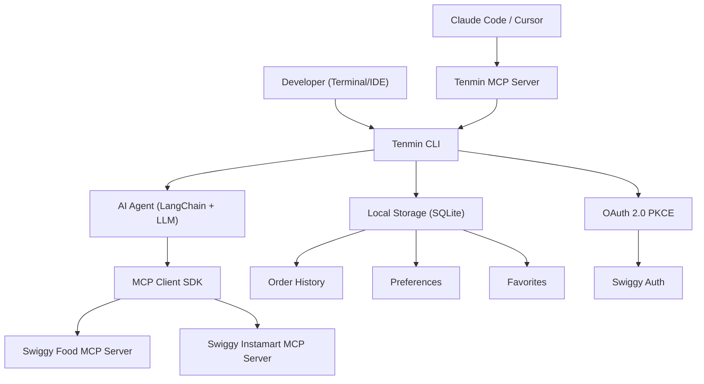
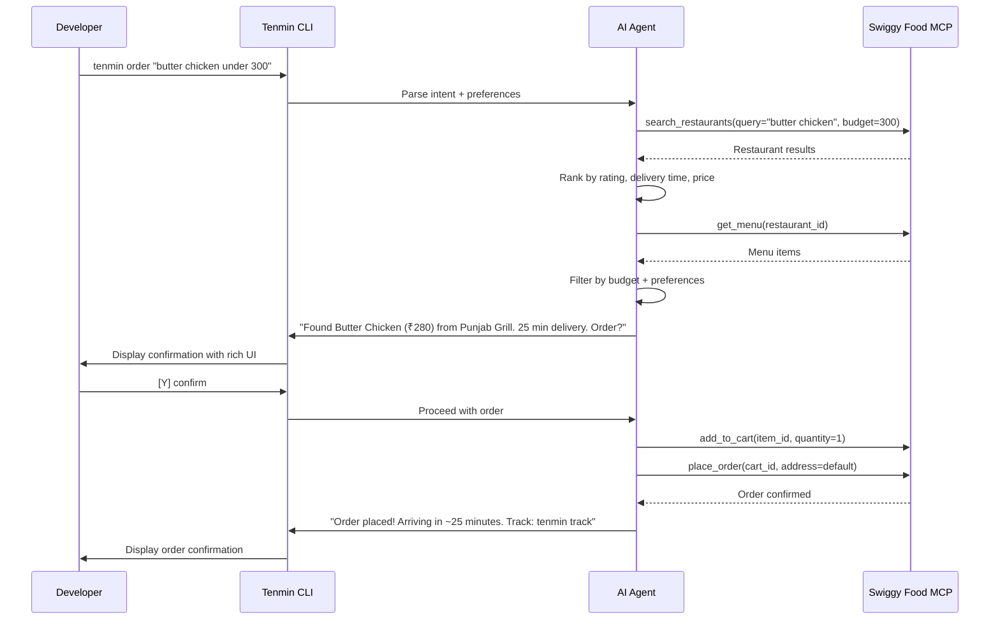

# Tenmin — Swiggy Builders Club Application

> **Goal**: Get accepted into the Swiggy Builders Club, build something impressive enough to get hired.

---

## 1. The Idea: Tenmin

### Elevator Pitch
**Tenmin** is an AI-native CLI tool and IDE plugin (Claude Code / Cursor / VS Code) that lets developers order food and groceries from Swiggy without ever leaving their terminal. When you're in flow state, you shouldn't have to pick up your phone, get sucked into Instagram, and lose 20 minutes. You type one command, your AI copilot handles the rest — from choosing what to eat to placing the order — in under 60 seconds.

### Why This Wins

| What Swiggy Wants | How Tenmin Delivers |
|---|---|
| *"AI agents that handle end-to-end food ordering via natural language"* | Core feature — conversational ordering from the terminal |
| *"Instamart agent that learns consumption patterns"* | Learns your pantry habits and suggests reorders |
| *"AI-Native Platform — build AI assistants, copilots, and automations"* | Built as a copilot-first experience inside developer tools |
| *"CLI Tool" is an explicit integration type* | This IS a CLI tool — exactly what they listed |
| *"Build something impressive and send us a demo. We hire from this program."* | Highly demo-able, unique, and immediately useful |

### Why Flow State Matters (The Story)
Developers lose an average of **23 minutes** to regain deep focus after a context switch (UC Irvine research). Picking up your phone to order food is one of the most common interruptions:

1. You unlock your phone
2. You see 14 notifications
3. You open Instagram "for a second"
4. 20 minutes later, you forgot to order food
5. You're hungry AND you lost your flow

**Tenmin eliminates this entirely.** You stay in your editor, type a command, and food arrives.

---

## 2. Product Features (MVP Scope)

### Core Features
- [x] 1. **`tenmin order`** — Start a conversational food ordering flow right in the terminal
- [x] 2. **`tenmin reorder`** — Reorder your last order or a saved favorite with one command (was `tenmin quick`)
- [x] 3. **`tenmin list`** — Quick grocery ordering from saved lists (milk, eggs, essentials)
- [x] 4. **`tenmin track`** — Check delivery status without leaving the terminal
- [x] 5. **`tenmin history`** — View past orders and reorder from history
- [x] 6. **`tenmin theme` / `budget`** — Set UI themes and view spending trends (replaces `tenmin preferences`)

### AI-Powered Features
- [x] **Natural language ordering**: `tenmin ask "something spicy under 300 for lunch"` → AI agent searches restaurants, filters by preferences, picks the best option, confirms with you, places order
- [ ] **Auto-Coupons**: Automatically calls `fetch_food_coupons` and `apply_food_coupon` to ensure developers get the best price without hunting for promo codes.
- [ ] **Smart Suggestions (Instamart)**: Leverages the `your_go_to_items` endpoint to provide zero-shot personalized grocery recommendations (Red Bull, coffee, snacks).
- [ ] **Dietary filtering**: Respects your calorie/macro preferences automatically
- [x] **Budget awareness**: View your spending summary and trends via `tenmin budget`

### IDE Plugin (Phase 2)
- **Claude Code MCP integration**: Tenmin as an MCP tool server that Claude Code can call
- **Cursor/VS Code extension**: Sidebar widget + command palette integration
- **Slash commands**: `/order`, `/track`, `/reorder` right in your editor chat

### Stretch Features (Post-MVP)
- **Team mode**: Collect orders from a dev team in a Slack channel, place one optimized group order
- **Pomodoro integration**: "Order food before my next focus session starts"
- **Calendar awareness**: Pre-schedule lunch orders based on your meeting gaps

---

## 3. Google Form Answers (Ready to Paste)

### What are you building? (2–3 sentences)
> **Tenmin** is an AI-native CLI tool and IDE plugin that lets developers order food and groceries from Swiggy without leaving their terminal or code editor. It uses natural language processing to handle end-to-end ordering — from restaurant discovery to cart management to checkout — all through a single conversational command. The goal is to eliminate the phone-based context switch that breaks developer flow state, delivering food in the most frictionless way possible.

### Which MCP servers do you need?
- [x] **Swiggy Food** — Core ordering engine for restaurant search, menu browsing, cart management, and food delivery
- [x] **Swiggy Instamart** — Quick grocery runs for desk essentials (coffee, snacks, energy drinks) without leaving the IDE

> *Skip Dineout for MVP — developers in flow state aren't going out to dine. Can add later for "team dinner" feature.*

### What type of integration is this?
- [x] **AI Agent / Copilot**
- [x] **CLI Tool**

> *It's both — an AI copilot accessed via CLI. Mention both.*

### Tech stack & architecture overview
> **CLI Layer**: Node.js/TypeScript CLI built with Commander.js + Ink (React for terminal UIs). Handles user input, renders rich terminal UI with interactive menus, spinners, and order confirmations.
>
> **AI Agent Layer**: LangChain.js orchestration with Claude/GPT as the reasoning LLM. The agent interprets natural language food requests, plans multi-step ordering workflows, and calls Swiggy MCP tools to execute. Implements a ReAct-style agent loop: user intent → restaurant search → menu filtering → cart building → order confirmation → checkout.
>
> **MCP Integration**: Connects to Swiggy's MCP servers (Food + Instamart) via the standard MCP client SDK. Each Swiggy MCP tool (search restaurants, browse menu, add to cart, place order) is registered as an agent tool. Auth handled via OAuth 2.0 with PKCE — tokens stored securely in the OS keychain.
>
> **IDE Plugin Layer** (Phase 2): Exposes Tenmin as an MCP tool server itself, so Claude Code and Cursor can invoke it natively. VS Code extension via the Extension API with command palette + sidebar widget.
>
> **Data Layer**: Local SQLite for order history, preferences, and cached favourites. No sensitive user data stored — all transaction data stays on Swiggy's platform.

### Redirect URI(s) for auth flows
> `http://localhost:9876/callback` — Local OAuth callback for CLI-based PKCE auth flow (standard pattern for CLI tools, similar to `gh auth login`)

### Expected request volume
> **< 1K/day** — Individual developer tool, each user makes 1-3 orders/day. During beta, expecting ~50-100 active users.

### Demo link, GitHub repo, or anything else
> **GitHub**: https://github.com/rushil1510/tenmin (repo will be live with MVP before review)
>
> We're building this with the explicit goal of demonstrating what's possible with Swiggy's MCP platform. Happy to share a recorded demo walkthrough within 1 week of gaining API access. The CLI's conversational UX is designed to showcase the full power of the MCP agent architecture — something that's novel in the Indian developer tool space.
>
> **Vision**: Every developer tool (GitHub CLI, Vercel CLI, Railway CLI) has proven that developers prefer staying in the terminal. Tenmin brings Swiggy to where developers already live.

---

## 4. Technical Architecture

### Request Flow: `tenmin order "butter chicken under 300"`

---

## 5. Execution Checklist

### Phase 0: Application (Do This NOW)
- [ ] Fill out the Google Form with answers from Section 3 above
- [ ] Create the `tenmin` GitHub repo (public)
- [ ] Add a killer README.md with the vision, architecture diagram, and "coming soon" roadmap
- [ ] Set up the project structure (Node.js + TypeScript)
- [ ] Push initial scaffolding so the repo isn't empty when they review

### Phase 1: Pre-Access MVP Shell (Before API Keys Arrive)
- [ ] **CLI Framework**: Set up Commander.js with all command stubs (`order`, `quick`, `instamart`, `track`, `history`, `preferences`)
- [ ] **Terminal UI**: Build rich terminal interface with Ink (React for CLI)
  - [ ] Interactive restaurant selection
  - [ ] Menu browsing with category navigation
  - [ ] Order confirmation screen with item details + price
  - [ ] Delivery tracking status display
  - [ ] Spinners, colors, and beautiful ASCII art branding
- [ ] **AI Agent scaffolding**: Set up LangChain.js agent with mock tools
  - [ ] Natural language intent parsing
  - [ ] ReAct agent loop architecture
  - [ ] Tool definitions matching expected MCP schema
- [ ] **Auth flow skeleton**: OAuth 2.0 PKCE flow with local callback server
- [ ] **Local storage**: SQLite setup for preferences, favorites, order history
- [ ] **Demo video**: Record a demo with mock data showing the full UX flow
- [ ] **Send the demo to builders@swiggy.in** with subject "Tenmin — CLI food ordering for developers"

### Phase 2: MCP Integration (Once API Access Granted)
- [ ] **MCP Client integration**: Connect to Swiggy Food MCP server
  - [ ] Implement `search_restaurants` tool
  - [ ] Implement `get_menu` / `browse_menu` tool
  - [ ] Implement `add_to_cart` / `manage_cart` tools
  - [ ] Implement `place_order` / `checkout` tool
  - [ ] Implement `track_order` tool
- [ ] **MCP Client integration**: Connect to Swiggy Instamart MCP server
  - [ ] Implement `search_products` tool
  - [ ] Implement `add_to_cart` tool
  - [ ] Implement `checkout` tool
- [ ] **Real auth flow**: Complete OAuth integration with Swiggy's auth system
- [ ] **Error handling**: Graceful failures, retry logic, rate limit awareness
- [ ] **End-to-end test**: Place a real order through the CLI

### Phase 3: Polish & Ship
- [ ] **Smart defaults**: Time-of-day suggestions, weather-based recommendations
- [ ] **Quick order**: `tenmin quick` for one-tap reordering
- [ ] **Beautiful README**: GIF demos, installation instructions, architecture docs
- [ ] **npm publish**: `npm install -g tenmin` 
- [ ] **Demo video**: Record production demo with real Swiggy data
- [ ] **Send final demo to builders@swiggy.in**

### Phase 4: IDE Plugin (The "Get Hired" Move)
- [ ] **Tenmin as MCP Tool Server**: Expose Tenmin's capabilities as an MCP server so Claude Code can use it natively — this shows Swiggy you understand the MCP ecosystem deeply
- [ ] **VS Code extension**: Command palette + sidebar panel
- [ ] **Cursor integration**: Native tool integration
- [ ] **Team features**: Slack bot for group ordering

---

## 6. What Will Make This Application Stand Out

> [!IMPORTANT]
> Swiggy explicitly says: *"Build something impressive and send us a demo. Standout projects get featured — and yes, we actively hire from this program."* This is the path.

### Why Swiggy Will Love This

1. **It's literally on their suggestion list**: They suggest "Conversational AI that handles end-to-end food ordering via natural language" — that's exactly what Tenmin is.
2. **"Coding Agents" Focus**: The Swiggy docs explicitly highlight plugging into "Claude Code, Cursor, Windsurf". Tenmin takes this a step further by being a dedicated CLI experience built specifically for this ecosystem.
3. **Developer-to-developer story**: Swiggy's engineering team will personally relate to "I don't want to pick up my phone while coding." This is a product *they* would use.
4. **MCP-native architecture**: By also exposing Tenmin as an MCP server (not just consuming MCP), you show deep platform understanding.
5. **The name "Tenmin"**: Implies speed — order in under a minute, delivered in ten. Simple, memorable, perfectly branded.

### How to Stand Out from Other Applicants

| What Others Will Do | What You'll Do |
|---|---|
| Submit a form and wait | Submit + email a demo video to builders@swiggy.in within 48 hours |
| Build a basic web app | Build a CLI tool — a unique integration type most won't attempt |
| Use one MCP server | Use Food + Instamart — show breadth |
| Describe what they'll build | Show a working prototype with mock data |
| Generic architecture | Detailed MCP-native architecture with sequence diagrams |

---

## 7. Timeline

| Week | Milestone |
|---|---|
| **Day 0 (Today)** | Submit application form + create GitHub repo with README |
| **Week 1** | CLI framework + terminal UI + AI agent with mock tools |
| **Week 1 End** | Record demo, email to builders@swiggy.in |
| **Week 2-3** | (Waiting for access) Polish UI, add more AI features with mock data |
| **Week 3-4** | (Access granted) Integrate MCP servers, real auth, real ordering |
| **Week 4-5** | Production polish, npm publish, final demo + send to Swiggy |
| **Week 5-6** | IDE plugin (the "hire me" differentiator) |

---

## 8. Quick Sanity Check Against Application Requirements

From the access page, here's what they check:

| Requirement | Status |
|---|---|
| Who you are — developer profile | ✅ Individual developer, Rushil Mital |
| What you're building — use case | ✅ Tenmin: CLI food ordering copilot |
| How it works — integration architecture | ✅ Detailed in Section 4 |
| Redirect URI(s) for auth | ✅ `http://localhost:9876/callback` |
| Static IP ranges | ℹ️ N/A for individual dev (dynamic IP, or can whitelist via VPN if needed) |
| Security contact | ✅ rushilmital003@gmail.com |
| Data handling and privacy | ✅ No sensitive data stored — all transaction data on Swiggy's platform, tokens in OS keychain |
| Acknowledgement of MCP terms | ✅ Yes |

> [!TIP]
> For "Static IP ranges" — since this is a CLI tool running on individual developer machines, you won't have static IPs. If they ask, explain that auth is per-user via OAuth PKCE and there's no centralized server making API calls. Each user authenticates directly.

---

## 9. Risk Mitigation

| Risk | Mitigation |
|---|---|
| Application rejected | Send a working demo to builders@swiggy.in proactively — hard to reject someone who already built something |
| MCP API schema unknown | Build with mock tools first, design agent to be tool-agnostic (LangChain makes swapping tools trivial) |
| Auth flow complexity | Use the standard OAuth PKCE pattern (same as GitHub CLI, Vercel CLI — well-documented) |
| Rate limits too low | MVP is personal use (1-3 orders/day). < 1K/day is more than enough |
| LLM costs for AI agent | Use local models (Ollama) for development, allow users to bring their own API key |

---

*Let's go get this, Rushil. Ship the form today, start building tonight.* 🚀
